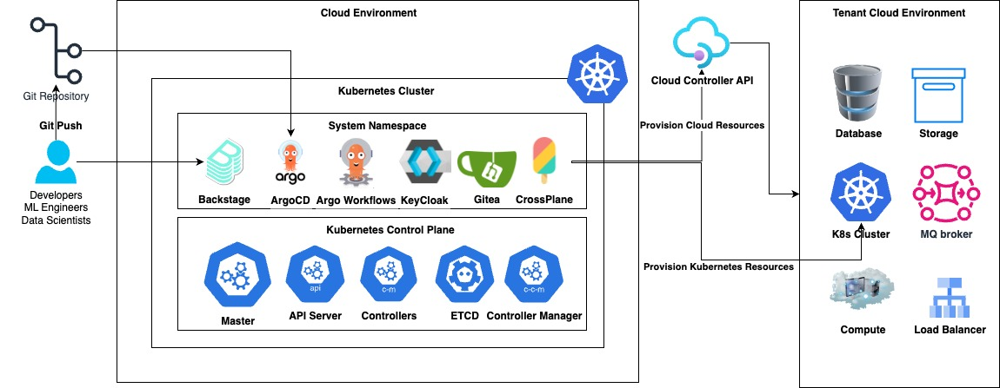
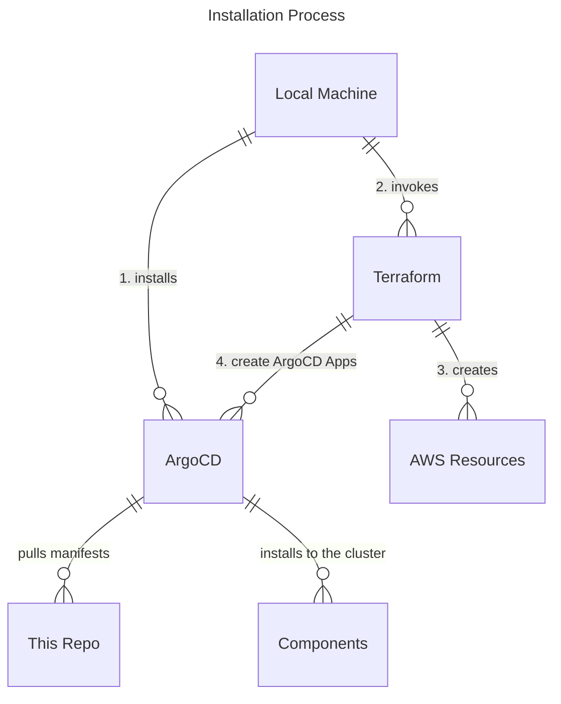

> **_NOTE:_**  Applications deployed in this repository are not meant or configured for production.


# Installation

- Installation script must be used with a EKS cluster because we use IRSA to talk to AWS services.
- Components are installed as ArgoCD Applications.
- Files under the `/packages` directory are meant to be usable without any modifications. This means certain configuration options like domain name must be passed outside of this directory. e.g. use ArgoCD's Helm parameters.

## Basic installation flow

The installation process follows the following pattern. 

1. Install ArgoCD.
2. Run Terraform. Terraform is responsible for:
    - Managing AWS resources necessary for the Kubernetes operators to function. Mostly IAM Roles.
    - Install components as ArgoCD applications. Pass IAM role information where necessary.
    - Apply Kubernetes manifests such as secrets and ingress where information cannot easily be passed to ArgoCD.
    - Run all the above in an order because installation order matters for many of these components. For example, Keycloak must be installed and ready before Backstage can be installed and configured.



This installation pattern where some Kubernetes manifests are handled in Terraform while others are handled in GitOps manner may not be suitable for many organizations. If you can be certain about parameters such as domain name and certificate handling, it is better to utilize GitOps approach where these information are committed to a repository. The reason it is handled this way is to allow for customization for different organizations without forking this repository and committing organization specific information into the repository.

## Requirements

- An existing EKS cluster version (1.27+)
- AWS CLI (2.13+)
- eksctl (0.167.0+)
- Kubectl CLI (1.27+)
- jq
- git
- yq
- curl
- kustomize


## Install

Follow the following steps to get started.

1. Create a new EKS cluster using our terraform scripts:
    ```./terraform/mgmt-cluster/install.sh```
2. Once installation completes, navigate to `backstage.<DOMAIN_NAME>` and log in as `user1`. Password is available as a secret. You may need to wait for DNS propagation to complete to be able to login. May take ~10 minutes.
    ```bash
    kubectl get secrets -n keycloak keycloak-user-config -o go-template='{{range $k,$v := .data}}{{printf "%s: " $k}}{{if not $v}}{{$v}}{{else}}{{$v | base64decode}}{{end}}{{"\n"}}{{end}}'
    ```


### Monitoring installation progress

Components are installed as ArgoCD Applications. You can monitor installation progress by going to ArgoCD UI. 

```bash
# Get the admin password 
kubectl -n argocd get secret argocd-initial-admin-secret -o jsonpath="{.data.password}" | base64 -d
```

Go to [`http://localhost:8081`](http://localhost:8081) and login with the username `admin` and password obtained above. In the UI you can look at resources created, their logs, and events.

### If you installed it without Cert Manager.


## What was created?

The following components are installed if you chose the full installation option.

| Name | Version |
|---|---|
| argo-workflows | v3.4.8 |
| argocd | v2.7.6 |
| aws-load-balancer-controller | v2.5.3 |
| backstage | v1.16.0 |
| cert-manager | v1.12.2 |
| crossplane | v1.12.2 |
| external-dns | v0.13.5 |
| ingress-nginx | v1.8.0 |
| keycloak | v22.0.0 |
| external-secrets | v0.9.2 |


## How to access the Components of the Platform?

Once the setup is complete, use the URLs from the output to login to backstage, ArgoCD, Argo, KeyCloak, Argo Workflows and Gitea.


#### ArgoCD

Click on the ArgoCD URL to navigate to your browser to access the ArgoCD App. User is `Admin` and the password is available in the `argocd` namespace.

```bash
# Get the admin password 
kubectl -n argocd get secret argocd-initial-admin-secret -o jsonpath="{.data.password}" | base64 -d
```

### Argo Workflows:

Click on the Argo Workflows URL to navigate to your browser to access the Argo Workflows App.  Two users are created during the installation process: `user1` and `user2`. Their passwords are available in the keycloak namespace.

```bash
k get secrets -n keycloak keycloak-user-config -o go-template='{{range $k,$v := .data}}{{printf "%s: " $k}}{{if not $v}}{{$v}}{{else}}{{$v | base64decode}}{{end}}{{"\n"}}{{end}}'
```

### Backstage:

Click on the Backstage URL to navigate to your browser to access the Backstage App.  Two users are created during the installation process: `user1` and `user2`. Their passwords are available in the keycloak namespace.

```bash
k get secrets -n keycloak keycloak-user-config -o go-template='{{range $k,$v := .data}}{{printf "%s: " $k}}{{if not $v}}{{$v}}{{else}}{{$v | base64decode}}{{end}}{{"\n"}}{{end}}'
```

### Gitea:

Click on the Gitea URL to navigate to your browser to access the Gitea App.  Username of the user is `GiteaAdmin` and Password of the user is `mysecretgiteapassword!`.

### Backstage:

Click on the Backstage URL to navigate to your browser to access the Backstage App.  Two users are created during the installation process: `user1` and `user2`. Their passwords are available in the keycloak namespace.

```bash
k get secrets -n keycloak keycloak-user-config -o go-template='{{range $k,$v := .data}}{{printf "%s: " $k}}{{if not $v}}{{$v}}{{else}}{{$v | base64decode}}{{end}}{{"\n"}}{{end}}'
```

## Uninstall
1. Run `setups/uninstall.sh` and follow the prompts.

## Troubleshooting

See [the troubleshooting doc](TROUBLESHOOTING.md) for more information.


