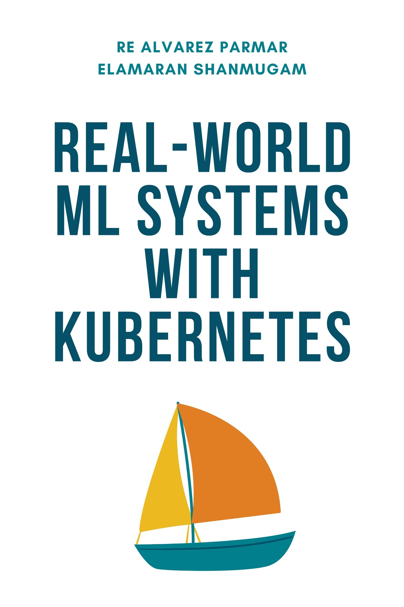

  

# Real-world ML systems with Kubernetes

  

## About This Book

Machine learning is no longer a research project–it's infrastructure. It's operations. It's pipelines, training, and inference. From recommending what to watch next to flagging fraudulent transactions, ML systems have become core components of modern software. But while building a model in a notebook is straightforward, scaling and deploying that model reliably in production is where most teams fail. According to Gartner, up to 85% of ML projects never reach their intended impact. Why? Because the hardest part isn't the model, it's everything around it.

Operationalizing machine learning means taking a promising prototype and integrating it into a system that can scale, recover from failure, adapt to new data, and stay performant over time. This transition demands much more than good models; it requires disciplined engineering across infrastructure, deployment, monitoring, and data pipelines. This is where MLOps comes in. MLOps is the intersection of machine learning, software engineering, and DevOps, a set of practices and tools that help teams build, deploy, and maintain ML systems at scale. And today, the most versatile platform for building MLOps infrastructure is Kubernetes.

This book teaches you how to design and operate scalable ML systems using Kubernetes. You'll learn the tools, patterns, and architectural principles needed to move machine learning beyond experimentation and into production safely, reliably, and repeatably. Whether you're building an internal platform or scaling an AI product, Kubernetes gives you the foundation to operationalize machine learning like software.

## What You'll Learn

This book covers the essential topics for building production-ready ML systems on Kubernetes:

- **Accelerating machine learning innovation using MLOps and Kubernetes**  
- **Fundamentals of Kubernetes**  
- **Building an ML Platform on Kubernetes**  
- **Scalable Data Pipelines with Kubernetes**  
- **Training Machine Learning Models on Kubernetes**  
- **Distributed Computing with Ray and Kubernetes**  
- **Operationalizing ML Models with Kubernetes**  
- **Serving LLMs on Kubernetes**  
- **Observing ML Applications in Kubernetes**

## Open Source & Support

We are open sourcing this book to make MLOps knowledge accessible to everyone. You can find the complete book content with PDF version in this repository - Book.pdf will be added soon!

If you find this book valuable and would like to support our work, you can purchase the Kindle edition: [📚 Available on Amazon Kindle](https://www.amazon.com/gp/product/B0FQ4BFHLV/ref=kinw_myk_ro_title)

# About the Authors

## Elamaran (Ela) Shanmugam

Elamaran (Ela) Shanmugam is a Sr. Specialist Solutions Architect with Amazon Web Services with over 20 years of experience in architecting, developing and day 2 operations of large scale enterprise systems and applications. Ela helps AWS customers and partners to build products and services using modern technologies to enable their business. Ela is a Container, App Modernization, Observability, Generative AI and Machine Learning SME and helps AWS partners and customers design and build scalable, secure, and optimized workloads on AWS. Being a Sr. technologist, Ela's focus is on modern application development, cloud migration, modernization and automation. Being at AWS, Ela enjoys contributing to open source, public speaking, mentoring, and publishing engaging technical content such as AWS Whitepapers, AWS Blogs, Internal articles. Ela is based out of Tampa, Florida, and you can reach Ela on Twitter @IamElaShan and elamaran11 on GitHub.

## Re Alvarez Parmar

Re Alvarez Parmar has spent over two decades architecting, building, and operating enterprise systems and infrastructure. In his current role at AWS as Principal Solutions Architect, he helps some of most the sophisticated Automotive companies modernize and scale their software architecture using cloud. His focus over the past few years has been cloud-native architecture, modern application development, and distributed systems.
